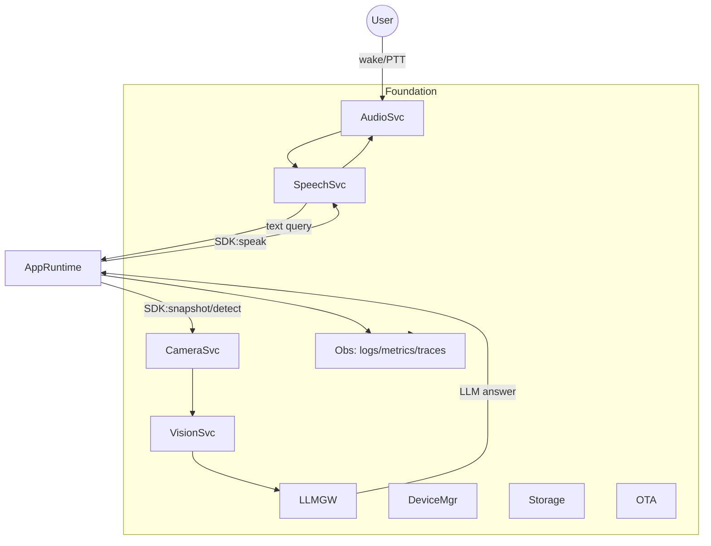

# AI Glasses Platform Plan

## A) System Overview

- Pi 5 pocket hub runs Foundation services (systemd-managed) exposing local gRPC/HTTP APIs to SDK apps. Camera (IMX500) on glasses feeds frames + on-sensor detections; optional HAT+ for heavier CV. AirPods provide bi-directional audio (voice input + TTS output). LLM requests go to LAN MacBook service or cloud, selected via config.
- Data path: wake/PTT → Audio capture → Speech (VAD/wake, STT) → Vision snapshot from Camera → Vision fusion (IMX500 + optional HAT+) → LLM Gateway → Speech TTS → Audio playback. Observability + privacy guardrails wrap all services.

## B) Hardware & OS Assumptions

- Pi 5, Pi OS Bookworm 64-bit, headless; systemd as init. Kernel with IMX500 + HAT+ drivers enabled.
- Bluetooth audio via PipeWire + WirePlumber; BlueZ for pairing; profiles: HFP/HSP for mic, A2DP for playback (switchable policy).
- Camera stack: libcamera/rpicam with IMX500 support; on-sensor NN via IMX500 SDK tools; CSI ribbon to glasses module.
- AI HAT+: HailoRT runtime + hailo-rpi packages; optional pipeline via GStreamer/libhailort.

## C) Foundation Layer Plan

(Each is a systemd service; gRPC/HTTP JSON where noted; structured logs to journald + OpenTelemetry exporter.)1) Device Manager

- Purpose: boot orchestration, config load, health aggregation.
- Process: daemon; watches services via systemd DBus; exposes `/health` HTTP + gRPC.
- Interfaces: config file `/etc/aiglasses/config.yaml`; CLI `aigctl status`; emits events on NATS/DBus.
- Failures: service crash → restart policy; config error → safe mode with minimal services.
- Telemetry: boot timing, health gauges.

2) Camera Service

- Purpose: frame capture, screenshot API, IMX500 inference results API.
- Process: daemon using libcamera; IMX500 on-sensor NN control.
- Interfaces: gRPC/HTTP: `Snapshot()`, `SubscribeDetections()`. Publishes detections to pub/sub.
- Failures: camera busy/lost → retry/backoff; sensor fault → surface degraded status.
- Telemetry: capture latency, sensor errors.

3) Audio Service

- Purpose: AirPods connectivity, mic capture, playback routing.
- Process: daemon; interfaces BlueZ/pipewire. Maintains link quality.
- Interfaces: gRPC: `OpenMic(stream)`, `PlayAudio(stream)`, `DeviceState`. CLI `aigctl audio pair`.
- Failures: BT drop → auto-reconnect; fallback to Pi mic/speaker if configured.
- Telemetry: BT RSSI, underruns/overruns, device state changes.

4) Speech Service

- Purpose: wake word/PTT, VAD, STT, TTS.
- Process: daemon; consumes audio stream from Audio Service; can run on-device VAD/wake (e.g., Porcupine-like), STT via local small model (whisper.cpp tiny) or remote; TTS via Piper local or remote.
- Interfaces: gRPC: `DetectWake()`, `Transcribe(stream)`, `Synthesize(text|ssml)`; events to pub/sub.
- Failures: STT unavailable → fallback to remote; TTS failure → textual response only.
- Telemetry: latency per stage, wake false/true positives.

5) Vision Service

- Purpose: object recognition pipeline; fuse IMX500 detections + optional HAT+ CV.
- Process: worker; subscribes to Camera detections/frames. Runs post-processing and higher-level descriptors.
- Interfaces: gRPC: `DetectObjects(frame_ref|live)`, `DescribeScene(frame_ref)`; publishes structured detections.
- Failures: HAT+ unavailable → IMX500-only; model load fail → use default baseline labels.
- Telemetry: model latency, fps, fusion success rate.

6) LLM Gateway

- Purpose: broker to LAN MacBook LLM or cloud (OpenAI-compatible) with retry/policy.
- Process: stateless service; supports streaming responses; token budgeting.
- Interfaces: gRPC/HTTP: `Chat(stream)`; supports tool-calling hooks for SDK apps.
- Failures: remote unreachable → fallback provider; circuit breaker; cache last good answer for retries.
- Telemetry: latency, tokens, failures; provider health.

7) App Runtime

- Purpose: sandbox/host SDK apps; manage lifecycle, permissions, resource limits (cgroups).
- Process: supervisor + per-app worker (Go/Python runner); IPC over gRPC/local sockets.
- Interfaces: app manifest-driven permissions; `aigctl app install/start/stop/logs`.
- Failures: app crash → restart with backoff; deny resources if permissions missing.
- Telemetry: per-app CPU/mem, call counts to services.

8) Storage/Privacy Module

- Purpose: retention policies, encrypted temp storage, redaction hooks.
- Process: library + small daemon enforcing cleanup cron; optional LUKS/FS-level encryption; uses tmpfs for short-lived media.
- Interfaces: policy file; SDK helpers for ephemeral handles; `Purge()` RPC.
- Failures: low disk → aggressive purge; policy parse fail → default minimal retention.
- Telemetry: retention actions, disk usage.

9) OTA/Update

- Purpose: deliver system + model + app updates; v0.1 manual, design for OTA (rauc or apt repo).
- Process: updater CLI/daemon; atomic service restarts.
- Interfaces: `aigctl update check/apply`; channel config.
- Failures: failed update → rollback; power-loss-safe via A/B or staged.
- Telemetry: version, update status.

## D) SDK Plan

- Principles: stable APIs, transport-agnostic (gRPC first, REST optional), strong typing, permission-aware, testable with mocks.
- Public APIs (pseudo):
- audio: `listen(opts) -> audioStream`, `transcribe(audioStream|live)->text`, `speak(text|ssml, voice?, stream?)`, `onWakeWord(cb)`.
- vision: `snapshot() -> frameRef`, `detectObjects(frameRef|live)->detections`, `describeScene(frameRef)->text`.
- llm: `chat(messages, tools?, stream?, providerOverride?) -> stream<delta>`.
- app lifecycle: `App.start(ctx, config)`, `App.stop()`, `onEvent(event)`, `requestPermissions(list)`.
- Event model: local pub/sub (NATS or gRPC streams) with topics: `audio.wake`, `vision.detections`, `app.events`.
- App manifest (YAML): name, version, entrypoint, permissions {camera, mic, bt, network, storage}, resource limits, env.
- Local dev: mocks for Audio/Camera/Vision/LLM; simulator on Mac; `sdk dev run --mock` then deploy via `sdk deploy --pi host`.
- Packaging: monorepo; SDK as Go/Python client libs versioned with Foundation release tags; semantic versioning.
- Docs: Quickstart, Concepts, API reference (auto-gen from protobuf), Guides (privacy, latency), Examples.

## E) Example App Plan ("What am I seeing?")

- Flow: wake/PTT → AudioSvc stream → SpeechSvc STT → SDK `snapshot()` → SDK `detectObjects()` (IMX500 detections; fallback HAT+) → SDK `describeScene()` optional → SDK `chat()` with prompt + detections → stream answer → SDK `speak()` to AirPods; also log to CLI/web.
- Service calls: use SDK wrappers; subscribe to wake events; call LLM Gateway with fused context; TTS streaming playback.
- Errors/fallbacks: AirPods missing → prompt to retry or switch to Pi mic/speaker; camera busy → retry/backoff; LLM down → cached template response; TTS fail → text-only.
- Latency budget: wake->STT 400-700ms (local VAD), snapshot 80-120ms, IMX500 detections ~10-20ms, LLM LAN 800-1500ms (stream early tokens), TTS stream start <300ms. Use parallelism: snapshot + detections in parallel with LLM prompt prep; stream playback while receiving.
- UI: CLI logs + optional local web status at `:8080` showing last query/answer/detections.

## F) Security, Privacy, Safety

- Threats: LAN eavesdrop, rogue apps, lost device. Mitigations: TLS to LLM, mTLS for LAN server, signed app manifests, permissions enforced in App Runtime.
- Storage: default no persistence; temp frames/audio in tmpfs; configurable retention; optional encrypted store.
- Network: TLS for all outbound; API keys in env/secret store; LAN discovery via mDNS with auth token.
- Indicators: LED/beep on capture; log event; SDK surfaces capture state to apps.
- Permissions: enforced by runtime pre-call checks; capability map in manifest.

## G) Testing & CI

- Unit tests: SDK APIs, parsers, manifests.
- Integration: service-to-service with mocks; audio/camera simulated streams.
- HIL: flagged tests to use real IMX500/Audio/HAT+ on bench Pi (GitHub Actions self-hosted runner).
- Performance: latency harness for wake→TTS; power draw sampling via INA219 if available.
- CI: GitHub Actions matrix (arm64 cross-build + lint + unit), nightly HIL on self-hosted Pi; artifacts: deb packages, container images; version tags per release.

## H) Roadmap

- v0.1: Manual setup, core services minimal; SDK alpha; example app end-to-end with LAN LLM; basic logs/health; AirPods pairing manual; acceptance: wake→describe→TTS works headless.
- v0.2: OTA skeleton, better privacy policies, web status UI, improved reconnection, basic metrics exporter.
- v0.5: Permissions hardened, A/B OTA, HAT+ CV path, app store-lite, more SDK languages.
- v1: Robust OTA, full privacy controls, production telemetry, stable SDK, multiple sample apps, optional HUD/gesture nice-to-have.

## Repo Structure (monorepo)